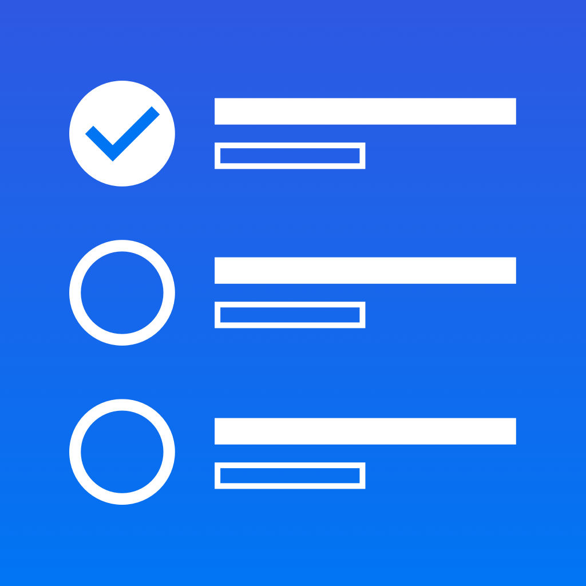

<div id="top"></div>
<!-- PROJECT LOGO -->
<br />
<div align="center" id="#top">
  <a href="https://github.com/othneildrew/Best-README-Template">
    
  </a>

  <h3 align="center">ToDo App using Flutter</h3>

  <p align="center">
    A small project to demonstrate Flutter and Dart skills.
    <br />
  </p>
  You can test the app using this APK directly
  <a href="https://github.com/the-app-developer/flutter_todo/releases/tag/v1.0">
    Release APK
  </a>
  <br />
  
  ``` 
  Test Email : test@test.com
  Test Password : 12345678
  ```
</div>

https://user-images.githubusercontent.com/87643346/143590450-92c1f9d6-83e7-40b5-9ecd-46c82fa4f53a.mp4

<!-- TABLE OF CONTENTS -->
<details>
  <summary>Table of Contents</summary>
  <ol>
    <li>
      <a href="#about-the-project">About The Project</a>
      <ul>
        <li><a href="#built-with">Built With</a></li>
      </ul>
    </li>
    <li>
      <a href="#getting-started">Getting Started</a>
    </li>

  </ol>
</details>


<!-- ABOUT THE PROJECT -->
## About The Project


A small ToDo app built using Flutter and Dart. This project uses Firebase as backend and Authenthentication to store and authenticate users into the app.

Like what I did with the project? I am available for more interesting projects. Please connect with me at the theapplicationdev@gmail.com


<p align="right">(<a href="#top">back to top</a>)</p>

### Built With

* [Flutter](https://flutter.dev/)
* [Dart](https://dart.dev/)
* [Firebase](https://firebase.google.com/)
* [Visual Studio Code](https://code.visualstudio.com/)

<p align="right">(<a href="#top">back to top</a>)</p>

<!-- GETTING STARTED -->
## Getting Started

This project has dependacies that are required to run the project. For example Firebase project, Visual Studion code, XCode, Android Studio etc development tools.

* [How to setup Flutter](https://docs.flutter.dev/get-started/install/)

## How to Use 

**Step 1:**

Download or clone this repo by using the link below:

```
https://github.com/the-app-developer/flutter-todo.git
```

**Step 2:**

Go to project root and execute the following command in console to get the required dependencies: 

```
flutter pub get 
```

**Step 3:**

This project uses `inject` library that works with code generation, execute the following command to generate files:

```
flutter packages pub run build_runner build --delete-conflicting-outputs
```

or watch command in order to keep the source code synced automatically:

```
flutter packages pub run build_runner watch
```

**Step 4:**

Setup Firebase and Move Firebase Json and Info.plist file as per the documentation:

* [Firebase Setup](https://firebase.google.com/docs/flutter/setup?platform=ios)


<p align="right">(<a href="#top">back to top</a>)</p>
